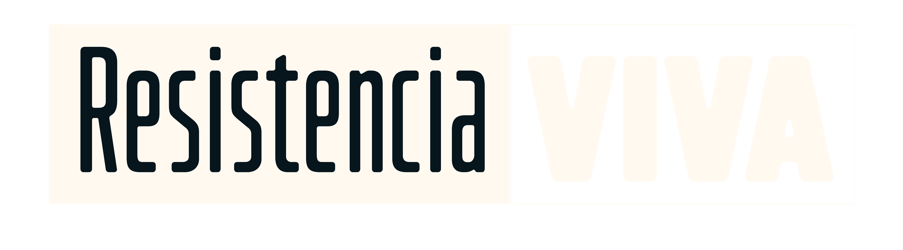

<p align="center">
  
</p>

<h1 align="center">Resistencia VIVA</h1>

<p align="center">
  Somos un blog creado con mucho amor ❤️, dedicado a compartir contenido, historias y experiencias de la ciudad de Resistencia.  
  Nuestro objetivo es construir un espacio donde la creatividad, la comunidad y la identidad local sean protagonistas.
</p>

---

## 👥 Integrantes del equipo

- 🎨 **Carla Fernández** — Diseño Gráfico Integral y Frontend   
- 🗄️ **Diego Zdunek** — Maestro de la Base de Datos   
- 🕶️ **Lucas Barrera** — El espíritu misterioso del equipo y del backend   
- 🧠 **Nayla Vega** — Backend y coordinación general del proyecto   

---

## 🛠️ Tecnologías utilizadas


---

## 🔐 Usuarios de prueba

> ⚠️ **Solo para entorno de desarrollo**

**Administrador**
- Usuario: `gatomachi`
- Contraseña: `contrauser123`

**Usuario estándar**
- Usuario: `user`
- Contraseña: `contrauser123`

---

## 📁 Estructura del proyecto

```text
blog
├── apps
│   ├── categorias
│   ├── comentarios
│   ├── contacto
│   ├── core
│   ├── post
│   ├── resistenciaViva
│   └── user
│
├── blog
│   ├── configurations
│   └── __pycache__
│
├── static
│   ├── css
│   ├── js
│   └── public
│
└── templates
    ├── auth
    ├── categorias
    ├── comentarios
    ├── componentes
    │   ├── commons
    │   ├── includes
    │   └── ui
    ├── core
    │   └── errors
    ├── layouts
    ├── post
    ├── resistenciaViva
    └── user
